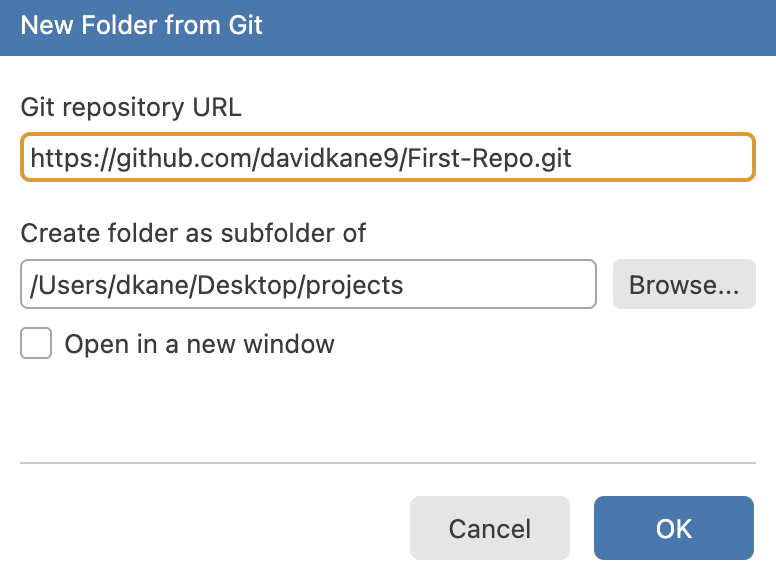

```{r setup, include = FALSE}
library(learnr)
library(tutorial.helpers)
library(tidyverse)
library(knitr)
library(usethis)
library(palmerpenguins)
library(gert)
library(gitcreds)

knitr::opts_chunk$set(echo = FALSE)
knitr::opts_chunk$set(out.width = '90%')
options(tutorial.exercise.timelimit = 60, 
        tutorial.storage = "local")
```

```{r copy-code-chunk, child = system.file("child_documents/copy_button.Rmd", package = "tutorial.helpers")}
```

```{r info-section, child = system.file("child_documents/info_section.Rmd", package = "tutorial.helpers")}
```

<!-- Stop being afraid of the command line. Use lots of git commands.  -->

<!-- Show some images from the Source Control button. -->

<!-- Add some questions to load the needed libraries, like usethis, gert, and gitconfig at the beginning. Or maybe we aren't really using those packages? -->

<!-- Add a new example at the end which requires users to fork a repo. -->

<!-- Here are some functions which might allow us to get rid of more Terminal commands in this tutorial: git_sitrep("git", "user") for git --version. Perhaps git_config_global() and/or git_config_set(name, value, repo = ".") for setting name and email values. -->

<!-- What about git remote -v (gert::git_remote_info()),  git log (gert::git_log()) -->

<!-- This would allow us to get rid of the Terminal Section. -->


<!-- When we say, your answer should look like, we often don't include the command even though your actual answer started with the command, since the instruction was CP/CR. -->


<!-- KNOWLEDGE DROPS: -->

<!-- Discuss the meaning of the lines which are in the .gitignore by default. Note they are different for Positron than for RStudio. -->


<!-- Can we add some tests? Currently, seems like lots of commands, like gert::git_log(), don't work in testing. Maybe set up a test environment of some type, perhaps by setting up all sets of scaffolding for testthat? -->

<!-- Update all the images. For example, the first one shows the project as existing in OneDrive, which is a bad idea! Make sure that the png file size is small. -->

## Introduction
### 

This tutorial covers [git](https://git-scm.com/), a program for keeping track of changes in your code, and [GitHub](https://github.com/), the leading company for storing your code in the cloud. Some material is from [*R for Data Science (2e)*](https://r4ds.hadley.nz/) by Hadley Wickham, Mine Çetinkaya-Rundel, and Garrett Grolemund.

The most useful reference for git/GitHub is [*Happy Git and GitHub for the useR*](https://happygitwithr.com/). Refer to that book whenever you have a problem.

## Terminal Overview
### 

The Positron [Terminal](https://docs.posit.co/ide/user/ide/guide/tools/terminal.html) is how you directly communicate with the computer using commands, whereas the Positron [Console](https://docs.posit.co/ide/user/ide/guide/code/console.html) is how you talk to R.

This section will help introduce you to the Terminal so that you'll be up to speed for the commands needed later.

### Exercise 1

Start by clicking on the Terminal tab in Positron. This is next to the Console tab in the bottom Panel.

You should see some text, which is a portion of the path to the current working directory, followed by a prompt such as a dollar sign. Copy (by highlighting, then right clicking and selecting the "copy" option) and paste the entire prompt into the box below.

We abbreviate the instructions **c**opy/**p**aste the **c**ommand/**r**esponse as CP/CR throughout this tutorial.

```{r terminal-overview-1}
question_text(NULL,
    answer(NULL, correct = TRUE),
    allow_retry = TRUE,
    try_again_button = "Edit Answer",
    incorrect = NULL,
    rows = 2)
```

### 

Your answer might be something like:

```         
Davids-MBP:projects dkane$ 
```

Or like:

```
dkane@MacBookPro projects %
```

Paths differ. They often include the username, which is `dkane` for me. They also usually specify the current directory, which is `projects` in this case. They usually end with a character like `$` or `%`. 

### Exercise 2

Type the command `pwd` in your Terminal and hit return. CP/CR.

```{r terminal-overview-2}
question_text(NULL,
    answer(NULL, correct = TRUE),
    allow_retry = TRUE,
    try_again_button = "Edit Answer",
    incorrect = NULL,
    rows = 2)
```

### 

Your answer should look like:

```         
dkane@MacBookPro projects % pwd
/Users/dkane/Desktop/projects
dkane@MacBookPro projects % 
```

Your answer will be different, not least because your username is unlikely to be `dkane`. This result of `pwd` is the location on your computer in which the R program started up when you opened Positron.

Going forward, make sure to pay special attention to whether given commands are supposed to be run in the *Console* or the *Terminal*.

<!-- DK: Add a guide to the window, including the Source Control button? -->

## Setting up GitHub
### 

Professionals store their work on GitHub, or a similar "source control" tool. If your computer blows up, you don't want to lose your work. GitHub is like Google Drive --- both live in the cloud --- but for your computational work rather than your documents.

GitHub is an online drive for all your R code and projects. In the professional world, what you have on your GitHub account is more important than what you have on your resume. It is a verifiable demonstration of your abilities.

### Exercise 1

Install [Git](https://git-scm.com/) by following the instructions of the [Install Git](https://happygitwithr.com/install-git.html) chapter in [*Happy Git and GitHub for the useR*](https://happygitwithr.com/).

### 

After you install Git, you should quit and then restart Positron so that it has a chance to "recognize" that Git is installed. (Note that restarting Positron is **not** the same as restarting your R session **within** your Positron instance. To quit Positron you need to go to the `Positron -> Quit Positron` menu item.)

After restarting Positron, click on the Terminal tab. Run `git --version` in the Terminal to make sure that Git is installed and accessible. CP/CR.

```{r setting-up-github-1}
question_text(NULL,
    answer(NULL, correct = TRUE),
    allow_retry = TRUE,
    try_again_button = "Edit Answer",
    incorrect = NULL,
    rows = 2)
```

### 

Your answer should look like:

```         
dkane@MacBookPro projects % git --version
git version 2.39.3 (Apple Git-146)
dkane@MacBookPro projects % 
```

The details will differ. Don't worry if you have a different version of Git installed.

[*Pro Git*](https://git-scm.com/book/en/v2) is the best reference book for Git and GitHub.

### Exercise 2

The next step is to create a GitHub account by following the instructions at the [GitHub homepage](https://github.com/). 

**Follow [this advice](https://happygitwithr.com/github-acct.html#username-advice) when choosing your username.** 

We recommend using a permanent email address for this account, not one which you lose access to when, for example, you change schools or jobs.

Copy your GitHub account URL in the field below.

```{r setting-up-github-2}
question_text(NULL,
    answer(NULL, correct = TRUE),
    allow_retry = TRUE,
    try_again_button = "Edit Answer",
    incorrect = NULL,
    rows = 2)
```

### 

Your answer should look like this:

```         
https://github.com/your-username
```

[Git](https://en.wikipedia.org/wiki/Git) is "software for tracking changes in any set of files, usually used for coordinating work among programmers collaboratively developing source code during software development."

### Exercise 3

Now that you have your GitHub account, you need to connect it to Positron. The first step of doing this is to give Positron your GitHub account user name and email.

### 

<!-- Ran into an issue here where `usethis::use_git_config(user.name = "your-username", user.email = "your@email.org")` would produce an error if you had multiple `user.name`s or `user.email`s saved (this can be checked using `usethis::git_sitrep()`). To fix this, I first used the terminal command `git config --global --replace-all user.name "newname"`. However, there seemed to be an issue where the terminal would say it is replaced but it wasn't being recognized. In the end, I was able to locate the actual global git config file under `C:/User/username/` and edit it directly. In the file, there were fields formatted like `name = ...` and `email = ...`. Deleting these lines completely seemed to work correctly. Afterwards (Good to restart R session here), running `usethis::git_sitrep()` will show that the fields are not set and you should now be able to run `usethis::use_git_config(user.name = "your-username", user.email = "your@email.org")` without error. -->

In the Console, run this command, substituting the email and user name you used for your GitHub account:

```         
usethis::use_git_config(user.name = "your-username", user.email = "your@email.org")
```

Note that this will not return anything. As long as you don't get an error message, it (probably) worked.

### 

Run `git config --global user.name` in the *Terminal* to make sure your computer remembers your GitHub username. CP/CR.

```{r setting-up-github-3}
question_text(NULL,
    answer(NULL, correct = TRUE),
    allow_retry = TRUE,
    try_again_button = "Edit Answer",
    incorrect = NULL,
    rows = 2)
```

### 

You answer should look like this:

```         
dkane@MacBookPro projects % git config --global user.name
David Kane
dkane@MacBookPro projects % 
```

Of course, it should be your username, not mine!

### Exercise 4

Run `git config --global user.email` in the *Terminal* to make sure your GitHub email is stored too. CP/CR.

```{r setting-up-github-4}
question_text(NULL,
    answer(NULL, correct = TRUE),
    allow_retry = TRUE,
    try_again_button = "Edit Answer",
    incorrect = NULL,
    rows = 3)
```

### 

Your answer should look like:

```         
dkane@MacBookPro projects % git config --global user.email
dave.kane@gmail.com
dkane@MacBookPro projects % 
```

Now, your GitHub username and email are stored so that your computer can automate a lot of the tedious steps required to communicate with GitHub.

### Exercise 5

**Note:** Make sure you received the expected outputs of the name and email associated with your GitHub account in the previous two exercises.

If, in our metaphor, GitHub is your Google Drive, then GitHub repositories, or "repos," are the Google folders, the location in which we store our work. Let's make a practice repo!

To begin, sign into GitHub and go to the homepage: `www.github.com`. Click the green "New" button on the upper left side of the page.


```{r}

```

Name your repository `First-Repo`. Then, select the "public" option for your repo.

```{r}
include_graphics("images/new-repo-1.png")
```

Then, check the box saying "Add a README file". [README](https://en.wikipedia.org/wiki/README) is a document where programmers explain details of their project. When in doubt follow [these instructions](https://happygitwithr.com/push-pull-github.html#make-a-repo-on-github).


```{r}
include_graphics("images/new-repo-2.png")
```

After you've done that, go ahead and click "Create repository" to create your first repo!

### 

GitHub should have directed you to a page called the project page after creating the repo. Copy and paste the URL of the project page below.

```{r setting-up-github-5}
question_text(NULL,
    answer(NULL, correct = TRUE),
    allow_retry = TRUE,
    try_again_button = "Edit Answer",
    incorrect = NULL,
    rows = 2)
```

### 

Your answer should look like:

```         
github.com/davidkane9/First-Repo
```

The "public" option means that anyone will be able to view the repository. But only you can edit it. You might have noticed "Add .gitignore" as another option, but we will never check this box because Positron will automatically create a `.gitignore` file for us when we connect the GitHub repo to an R project on our computer.

### Exercise 6

The next step will be to create the exact same project on your local computer through the process of **cloning**. By having a local and a GitHub version, you can edit your project on your computer and then send all the changes you've made to GitHub. This process ensures that the GitHub version is synced up with your local version.

To clone the repo, click on the green button that says "Code". Then, copy the link shown. You can use the clipboard button on the right to automatically copy it.

```{r}
include_graphics("images/repo_clone.png")
```

Paste the link below.

```{r setting-up-github-6}
question_text(NULL,
    answer(NULL, correct = TRUE),
    allow_retry = TRUE,
    try_again_button = "Edit Answer",
    incorrect = NULL,
    rows = 2)
```

### 

It should look something like:

```         
https://github.com/davidkane9/First-Repo.git
```

This link points to your project folder on GitHub. It is slightly different from the URL of the project page because the `.git` suffix tells you that it's a special GitHub object, not a webpage.

### Exercise 7

Read through all these steps before starting the process of connecting your repo to a project on your computer.

-   Click the `New` menu dropdown item from top left of the Positron window.

```{r}
include_graphics("images/new-git-1.png")
```

-   Select `New Folder from Git ...`.

-   Paste in your GitHub URL to the  "Git repository URL" box. Ensure that the "Create folder ..." box specifies your `projects` folder. Click the "Open in new window" box.

```{r}

```

-   Click "OK."

This will open the `First-Repo` project in a new Positron window. 

### Exercise 8

**All further questions in this tutorial should be completed in the `First-Repo` project, not in the Positron window in which this tutorial is running.**

Confirm that your setup is correct. In the Terminal, run `git remote -v`. CP/CR.

```{r setting-up-github-8}
question_text(NULL,
    answer(NULL, correct = TRUE),
    allow_retry = TRUE,
    try_again_button = "Edit Answer",
    incorrect = NULL,
    rows = 2)
```

Your answer should look something like:

```         
Davids-MBP:First-Repo dkane$ git remote -v
origin  https://github.com/davidkane9/First-Repo.git (fetch)
origin  https://github.com/davidkane9/First-Repo.git (push)
Davids-MBP:First-Repo dkane$ 
```

Don't worry too much about the details. You've successfully linked a repo to an Positron Project!

### Exercise 9

You have linked your GitHub repo to your R project, but you haven't proven that you are someone with editing access to the project. If we just let anyone with the GitHub link edit our repo, that's obviously going to lead to problems. This is why we use something called a **p**ersonal **a**ccess **t**oken, or a **PAT**.

### 

A PAT is just a special computer-generated password between your computer and GitHub that lets GitHub connect your GitHub account and your computer. If you want to learn more, see "[Personal access token for HTTPS](https://happygitwithr.com/https-pat.html)" from [*Happy Git and GitHub for the useR*](https://happygitwithr.com/)

### 

Create a PAT by using the `usethis::create_github_token()` function in the Console. This should redirect you to a GitHub page about creating a PAT.

### 

Set the "Note" field to "My First PAT" and keep the scopes the same as the **default**. It should look something like the picture below (Doesn't have to be exact).

```{r setting-up-github-9}

```

### 

Press "Generate Token" at the bottom of the page to finalize your PAT. If you have trouble, the function `usethis::gh_token_help()` may be helpful.

### Exercise 10

Now that we've created our PAT, first temporarily copy it somewhere you have easy access to. We will need to store it somewhere so that Positron can "see" it.

Run `gitcreds::gitcreds_set()` in the Console and follow the prompts, providing your token when asked.

### 

Restart your R session with `Session -> Restart R`. (This is not the same thing as restarting Positron.) You could also use `Cmd/Ctrl + Shift + 0` to restart R. Using the shortcut key is always a good idea. (On Windows, this would be `Ctrl + Shift + F10`.)

Run `usethis::git_sitrep()` in the Console. CP/CR.

```{r setting-up-github-10}
question_text(NULL,
    answer(NULL, correct = TRUE),
    allow_retry = TRUE,
    try_again_button = "Edit Answer",
    incorrect = NULL,
    rows = 12)
```

### 

The key "GitHub user" section should look something like:

```         
── GitHub user 
• Default GitHub host: 'https://github.com'
• Personal access token for 'https://github.com': '<discovered>'
• GitHub user: 'davidkane9'
```

See "[Managing Git(Hub) Credentials](https://usethis.r-lib.org/articles/git-credentials.html)" for more details.

## Updating .gitignore
### 

The `.gitignore` file determines which files **git** should **ignore**. You should be able to see your `.gitignore` file in the Files tab in the Output pane.

(To see any files which are "hidden" --- those that begin with a period `.` --- you may need to click on the gear symbol in the Files tab (next to the "Rename" button) and then select "Show Hidden Files".)

### Exercise 1

From the Console, run `list.files()`. CP/CR.

```{r updating-gitignore-1}
question_text(NULL,
	answer(NULL, correct = TRUE),
	allow_retry = TRUE,
	try_again_button = "Edit Answer",
	incorrect = NULL,
	rows = 3)
```

```{r updating-gitignore-1-test, include = FALSE}
list.files()
```

### 

In the "Positron and Code" tutorial, we saw that an R project begins with just one file, the `Rproj` file, which is `First-Repo.Rproj` in this case. But, because this R project started by connecting to a GitHub repo --- and because we initialized that repo with a README --- we also have a `README.md` file.

### Exercise 2

From the Console, run `list.files(all.files = TRUE)`. CP/CR.

```{r updating-gitignore-2}
question_text(NULL,
	answer(NULL, correct = TRUE),
	allow_retry = TRUE,
	try_again_button = "Edit Answer",
	incorrect = NULL,
	rows = 3)
```

```{r updating-gitignore-2-test, include = FALSE}
list.files(all.files = TRUE)
```

### 

Because `.gitignore` is a "hidden" file, since its name begins with a `.`, we need to set `all.files = TRUE` in `list.files()` if we want it to be returned. Don't worry about hidden directories like `.git` and `.Rproj.user`. We won't be using them.

### Exercise 3

The purpose of `.gitignore` is to list all the files that you don't want to be uploaded to GitHub. This is especially useful when you are working with big datasets or files with private information.

Open the `.gitignore` and add a new line with `First-Repo.Rproj`. This tells Git to ignore any file named `First-Repo.Rproj`. Save the file, but make sure that the last line in the file is blank.

In the Console, run:

```         
tutorial.helpers::show_file(".gitignore")
```

CP/CR.

```{r updating-gitignore-3}
question_text(NULL,
	answer(NULL, correct = TRUE),
	allow_retry = TRUE,
	try_again_button = "Edit Answer",
	incorrect = NULL,
	rows = 3)
```

<!-- No test case because .gitignore won't exist in testing. -->

### 

This should output all of the lines in your `.gitignore` file, which should include `First-Repo.Rproj`.

We could also have used `*.Rproj`. The \* tells your computer that we want to prevent all files ending in `Rproj` from being uploaded.

### Exercise 4

Navigate to the Git tab in the Environment pane. You should see `.gitignore` listed but not `First-Repo.Rproj`. The Git tab shows all the changes you have made on your local computer. Since you added `First-Repo.Rproj` in `.gitignore`, `First-Repo.Rproj` should not show up as one of the changed files that the GitHub version needs to be synced with.

If you do see `First-Repo.Rproj`, try clicking on the refresh button --- a small clockwise swirl --- in the upper right. Or make sure you have it spelled correctly.

```{r}
include_graphics("images/updated_gitignore.png")
```

### Exercise 5

Now that we've updated our `.gitignore` file, we want to upload this new version to GitHub. Otherwise, GitHub doesn't know that we want to hide our `First-Repo.Rproj` file.

### 

To do so, go to the Git tab in the Environment pane toward the top right of your screen. Click the check box next to the `.gitignore` file and then click on the "Commit" button.

```{r}
include_graphics("images/commit.png")
```

### 

This will open a new window where you will write a commit message. The message is meant to note what you're adding/changing within the repo. And yes, it's mandatory. Just a few (sensible) words are enough.

### Exercise 6

In the Console, run:

```         
gert::git_log() |> select(-commit, -merge, -files) |> dplyr::slice(1)
```

CP/CR.

This returns the author, time, and message of the last commit.

```{r updating-gitignore-6}
question_text(NULL,
    answer(NULL, correct = TRUE),
    allow_retry = TRUE,
    try_again_button = "Edit Answer",
    incorrect = NULL,
    rows = 2)
```

If you get an error about a function like `slice` or `select` not being found, then load the **dplyr** package with `library(dplyr)` and try again.

### Exercise 7

Next, press `Push`, i.e., the green arrow on the top right. This pushes or uploads the changes to GitHub. Open up GitHub and refresh the project page to see the commit message you just made at the top of your repo page.

### 

Run `gert::git_ahead_behind()$ahead` in the Console. CP/CR.

```{r updating-gitignore-7}
question_text(NULL,
    answer(NULL, correct = TRUE),
    allow_retry = TRUE,
    try_again_button = "Edit Answer",
    incorrect = NULL,
    rows = 2)
```

### 

This should return `0`, showing that you are 0 commits out of sync with the GitHub version.

## Publishing to R Pubs
### 

Let's publish a file from our project onto the internet using [R Pubs](https://rpubs.com/).

### Exercise 1

First let's make a new Quarto document. Select `File -> New File -> Quarto Document ...`. Change the title to "Example". You are the author. Keep the other fields as the default values. Save the file with `Cmd/Ctrl + S` and name the file `example`. Positron will automatically add the `.qmd` extension.

Run `list.files()`. CP/CR.

```{r publishing-to-r-pubs-1}
question_text(NULL,
    answer(NULL, correct = TRUE),
    allow_retry = TRUE,
    try_again_button = "Edit Answer",
    incorrect = NULL,
    rows = 2)
```

### 

You should see `example.qmd` somewhere in the output. Recall that the title inside of the document ("Example") has no *necessary* connection to the name of the file (`example.qmd`). However, it is often the case that they will be similar, as here.

### Exercise 2

Render this Quarto document by pressing the "Render" button or, better, with `Cmd/Ctrl + Shift + K`. Run `list.files()` in the Console. CP/CR.

```{r publishing-to-r-pubs-2}
question_text(NULL,
    answer(NULL, correct = TRUE),
    allow_retry = TRUE,
    try_again_button = "Edit Answer",
    incorrect = NULL,
    rows = 2)
```

### 

`example.html` should be one of the files outputted.

### Exercise 3

Notice the blue button at the top of your QMD. Click that and select RPubs. (If you completed the "Positron and Code" tutorial, you should already have an RPubs account.) If you do not have an account, you will need to create one. Always choose the free option.

Create a slug --- the file name for the last part of the URL --- like "my-project" and publish. Put the URL of your RPubs Page below:

```{r publishing-to-r-pubs-3}
question_text(NULL,
    answer(NULL, correct = TRUE),
    allow_retry = TRUE,
    try_again_button = "Edit Answer",
    incorrect = NULL,
    rows = 2)
```

### 

If you did not select a slug, then RPubs provided a meaningless slug, most likely a string of numbers. That does not look cool! Much better to have a slug which describes the file.

### Exercise 4

In the Git tab in the top right corner, check the boxes next to "example.qmd", and "example.html" to stage them. Do not check the box next to `example_files`. Press the commit button and add the commit message "published webpage".

### 

Now, press the `Push` button with the green arrow. Your changes have now been saved to GitHub! No need to worry about `example_files` right now. Quarto always creates a directory named `filename_files` and uses it for the tools/residues of the rendering process. Nothing in such files is worth saving.

### 

Run `gert::git_ahead_behind()$ahead` in the Console. This should return "0" just like before. CP/CR.

```{r publishing-to-r-pubs-4}
question_text(NULL,
    answer(NULL, correct = TRUE),
    allow_retry = TRUE,
    try_again_button = "Edit Answer",
    incorrect = NULL,
    rows = 2)
```

Nice work! You've created an RPubs page. All your work is backed up to GitHub.

### 

We now understand the entire data science work cycle. Begin with GitHub repository, connect to an Positron project, create a Quarto document (including a plot or other analysis), publish your results to RPubs, and, finally, commit/push all your work to GitHub. Let's practice these skills in some new projects.

## Summary
### 

This tutorial covered [git](https://git-scm.com/), a program for keeping track of changes in your code, and [GitHub](https://github.com/), the leading company for storing your code in the cloud. Some material is from [*R for Data Science (2e)*](https://r4ds.hadley.nz/) by Hadley Wickham, Mine Çetinkaya-Rundel, and Garrett Grolemund.

The most useful reference for git/GitHub is [*Happy Git and GitHub for the useR*](https://happygitwithr.com/). Refer to that book whenever you have a problem.

```{r download-answers, child = system.file("child_documents/download_answers.Rmd", package = "tutorial.helpers")}
```
